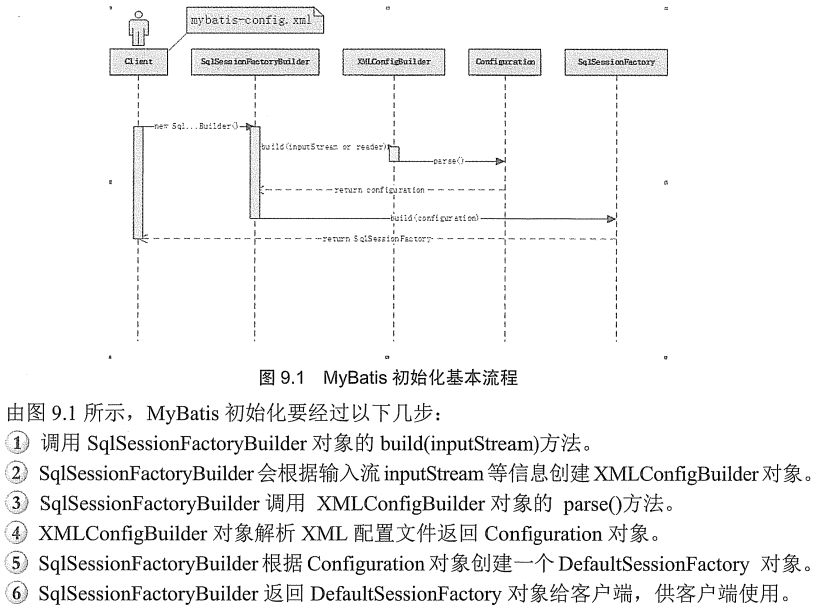

# MyBatis的基本用法 #

## MyBatis的体系结构 ##

### SqlSessionFactory ###

它是单个数据库映射关系经过编译后的内存镜像

### SqlSession ###

它是 **应用** 与 **持久存储层** 之间执行交互操作的一个单线程对象

## 深入MyBatis的配置文件 ##

### MyBatis的配置文件结构 ###

- properties属性
- settings设置
- typesAliases类型命名
- typeHandler
- objectFactory
- plugins
- environments
	- environment
	- transactionManager
	- dataSource
- databaseIdProvider
- mappers

## 深入Mapper XML映射文件 ##

映射文件的常见元素

- select
- insert
- update
- delete
- sql 用于sql复用
- cache
- cache-ref
- resultMap

[示例Mapper XML](dml/UserMapper.xml)

[insert](dml/InsertTest.java)

[update](dml/UpadeTest.java)

[select](dml/SelectTest.java)

[delete](dml/DeleteTest.java)

[ResultMapTest](resultmap/ResultMapTest.java)

[SelectMapTest](resultmap/SelectMapTest.java)

---

多表查询必须用resultMap完成关联映射

[SelectStudentTest](resultmap/SelectStudentTest.java)

关键元素<association>

---

集合映射

[SelectClazzTest](resultmap/SelectClazzTest.java)

关键元素<collection>

