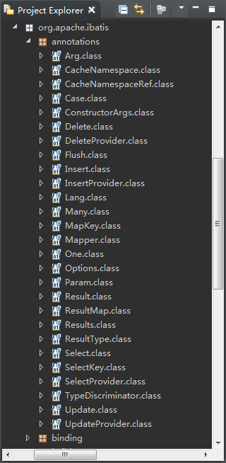

# MyBatis注解配置 #

## MyBatis常用Annotation ##

## MyBatis注解的使用 ##

测试select，insert，update，delete

[注解的使用](dml/UserMapper.java)

[insert](dml/InsertTest.java)

[select](dml/SelectTest.java)

[selectAll](dml/SelectAllTest.java)

[update](dml/UpdateTest.java)

[delete](dml/DeleteTest.java)

---

[一对一](one2one/)

[一对多](one2many/)

[多对多](many2many/)

---

[动态SQL](dynamicsql/)

